# meeting #1 - my-armageddon-project-1
### Group Leader: Omar Fleming
### Team Leader: Larry Harris
### Date: 01-04-25 (Sunday)
### Time: 2pm - 4:30 est.
----

### Members present: 
- Larry Harris
- Kelly D Moore
- Dennis Shaw
- Logan T
- Tre Bradshaw
- Bryce Williams
- Jasper Shivers (Jdollas)
- Ted Clayton
- Torray
- Zeek-Miller
- Jay Mallard

-----

### In today's meeting:
- created and instructed everyone to create a Terraform repo in Github to share notes and test the Terraform builds
- went through Lab 1a discussed, seperated Larry's main.tf into portions. We tested trouble shot, spun up the code. Dennis will upload to github and after Larry looks through it, will make it available for everyone to download
- everyone inspect, test and come back with any feedback, suggestions and or comments
- Here is the 1st draft diagram. We want to hear if you guys have any feedback or suggestions for this as well.

-------

### Project Infrastructure
VPC name  == bos_vpc01  
Region = US East 1   
Availability Zone
- us-east-1a
- us-east-1b 
- CIDR == 10.26.0.0/16 

|Subnets|||
|---|---|---|
|Public|10.26.101.0/24|10.26.102.0/24|  
|Private|10.26.101.0/24| 10.26.102.0/24|

-------

### .tf file changes 
- Security Groups for RDS & EC2

    - RDS (ingress)
    - mySQL from EC2

- EC2 (ingress)
    - student adds inbound rules (HTTP 80, SSH 22 from their IP)

*** reminder change SSH rule!!!

-------------

# meeting #2 - my-armageddon-project-1
### Group Leader: Omar Fleming
### Team Leader: Larry Harris
### Date: 01-05-25 (Monday)
### Time: 5pm - 8pm est.

----

### Members present: 
- Larry Harris
- Dennis Shaw
- Jasper Shivers (Jdollas)
- David McKenzie
- Ted Clayton
- LT (Logan T)

-----

### In today's meeting

- Review meeting 1
- make sure everyone has their github setup

----

### Fixes
- #### ERROR notice!!!
    - note - recursive error when you re-upload this build you will get an error:
    - "You can't create this secret because a secret with this name is already scheduled for deletion." AWS keeps the secret by default for 30 days after you destroy. Therefore run this code to delete now after each terraform destroy

>>>aws secretsmanager delete-secret --secret-id bos/rds/mysql --force-delete-without-recovery

- #### changes from week 1 files:
  - variables.tf - line 40 verify the correct AMI #
  - variables.tf - line 46 verfify if you are using T2.micro or T3.micro
  - variables.tf - line 83 use your email
  - delete providers.tf because it is duplicated in the auth.tf 
  - output.tf - line command out the the last two blocks (line 22-27)
  - JSON file - replace the AWS account with your personal 12 digit AWS account#

---------

### Deliverables
- go through the [expected lab 1a deliverables](https://github.com/DennistonShaw/armageddon/blob/main/SEIR_Foundations/LAB1/1a_explanation.md). Starting at #4 on the 1a_explanation.md in Theo's armageddon.

#### Architectural Design 

[Theo's outline](https://github.com/DennistonShaw/armageddon/blob/main/SEIR_Foundations/LAB1/1a_explanation.md)

- showing the logical flow 
  - A user sends an HTTP request to an EC2 instance
  - The EC2 application:
  - Retrieves database credentials from Secrets Manager
  - Connects to the RDS MySQL endpoint
  - Data is written to or read from the database
  - Results are returned to the user
- and satisfying the security model
  - RDS is not publicly accessible
  - RDS only allows inbound traffic from the EC2 security group
  - EC2 retrieves credentials dynamically via IAM role
  - No passwords are stored in code or AMIs

My flow query  

 - user -> the internet gateway attached to the VPC to the EC2 inside an AZ us-east-1a inside a Public Subnet, the EC2 has IAM roles attached, also, the EC2 in the public subnet -> SNS inside the Region US East 1 to the email Alert system administered by the SNS outside the Region east 1, also, the EC2 -> to the VPC endpoint -> secrets manager inside region US East 1 but outside of the AZ of us-east-1a, -> RDS inside the Private subnet inside us-east-1a -> Nat Gateway to the internet gateway to the user

Verified flow concept

1. User request is initiated from the internet.
2. The request passes through the Internet Gateway (IGW) attached to the VPC.
3. The traffic is routed to the EC2 instance in the public subnet (using its public IP/DNS).
4. The EC2 instance processes the request, communicates internally with Secrets Manager via a VPC endpoint to retrieve database credentials, and then connects to the RDS instance in the private subnet to query or store data.
5. The RDS instance sends the data back to the EC2 instance over the private network.
6. The EC2 instance generates a response and sends it back out through the Internet Gateway (IGW) to the User over the internet.
7. Separately, if an alert is triggered, the EC2 instance connects to the SNS regional endpoint (either via the IGW or a separate VPC endpoint) to send a notification, which SNS then delivers to the external email system. The NAT gateway is not typically involved in either of these primary request/response paths. 

screen capture (sc)1

-----

### A. Infrastructure Proof
  1) EC2 instance running and reachable over HTTP
   
sc0

  2) RDS MySQL instance in the same VPC

sc3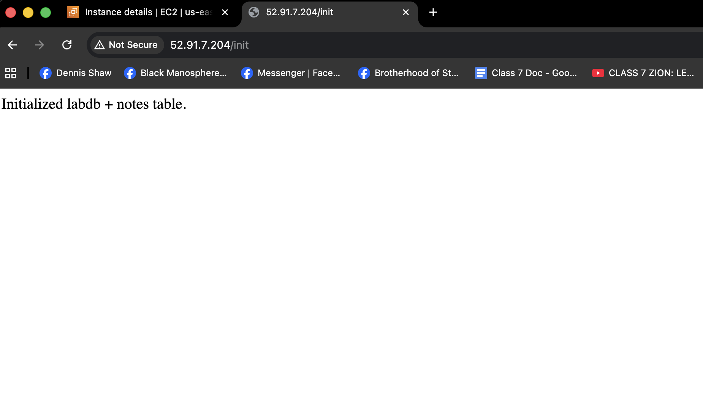
   
  3) Security group rule showing:
       - RDS inbound TCP 3306
      - Source = EC2 security group (not 0.0.0.0/0)  
  
  IAM role attached to EC2 allowing Secrets Manager access

sc00

Screenshot of: RDS SG inbound rule using source = sg-ec2-lab EC2 role attached 

sc1

------------

### B. Application Proof
  1. Successful database initialization
  2. Ability to insert records into RDS
  3. Ability to read records from RDS
  4. Screenshot of:
     - RDS SG inbound rule using source = sg-ec2-lab
     - EC2 role attached

- http://<EC2_PUBLIC_IP>/init

sc3

- http://<EC2_PUBLIC_IP>/add?note=first_note

sc4

- http://<EC2_PUBLIC_IP>/list

sc7

  - If /init hangs or errors, it’s almost always:
    RDS SG inbound not allowing from EC2 SG on 3306
    RDS not in same VPC/subnets routing-wise
    EC2 role missing secretsmanager:GetSecretValue
    Secret doesn’t contain host / username / password fields (fix by storing as “Credentials for RDS database”)

- list output showing at least 3 notes

sc5

sc6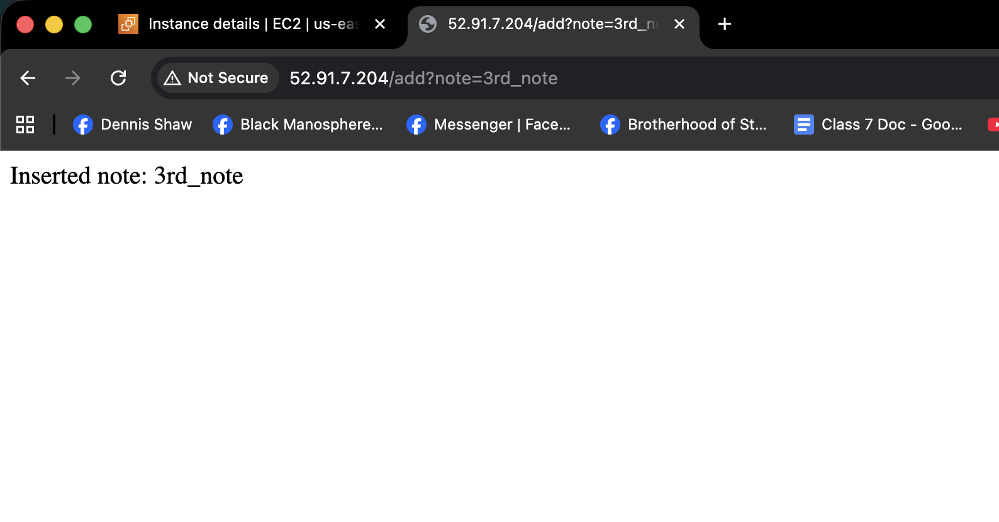

-----

### C. Verification Evidence
- CLI output proving connectivity and configuration
- Browser output showing database data
- Copy and paste this command your vscode terminal 

>>>mysql -h bos-rds01.cmls2wy44n17.us-east-1.rds.amazonaws.com -P 3306 -u admiral -p 

- (you can get this from the command line in vscode in the output section)

sc10

------

Connect to AWS CLI

- go to instances > connect > Session manager (because its in a private subnet you can't access this though public internet) > connect

sc8

sc9

------

## 6. Technical Verification 

### 6.1 Verify EC2 Instance
run this code in terminal

>>>aws ec2 describe-instances --filters "Name=tag:Name,Values=bos-ec201" --query "Reservations[].Instances[].{InstanceId:InstanceId,State:State.Name}"

#### Expected:
  - Instance ID returned  
  - Instance state = running

sc17

-------

### 6.2 Verify IAM Role Attached to EC2
>>>aws ec2 describe-instances \
  --instance-ids <INSTANCE_ID> \
  --query "Reservations[].Instances[].IamInstanceProfile.Arn"

#### Expected:
- ARN of an IAM instance profile (not null)

sc18

----------

### 6.3 Verify RDS Instance State
>>>aws rds describe-db-instances \
  --db-instance-identifier bos-rds01 \
  --query "DBInstances[].DBInstanceStatus"

#### Expected 
  Available

sc19

----------

### 6.4 Verify RDS Endpoint (Connectivity Target)
>>>aws rds describe-db-instances \
  --db-instance-identifier bos-rds01 \
  --query "DBInstances[].Endpoint"

#### Expected:
- Endpoint address
- Port 3306

sc20

----   

### 6.5 (works)

>>>aws ec2 describe-security-groups --filters "Name=tag:Name,Values=bos-rds-sg01" --query "SecurityGroups[].IpPermissions"
         
#### Expected: 
- TCP port 3306 
- Source referencing EC2 security group ID, not CIDR

sc21

----  

### 6.6 (run command inside ec2 sessions manager) (works)
SSH into EC2 and run:

>>>aws secretsmanager get-secret-value --secret-id bos/rds/mysql
                
                
#### Expected: 
- JSON containing: 
  - username 
  - password 
  - host 
  - port
        

sc22

---------

### 6.7 Verify Database Connectivity (From EC2)
Install MySQL client (temporary validation):
sudo dnf install -y mysql

#### Connect: this next command 6.7 was aready added into the user data therefore no need to run now. See line 4 in user data
>>>mysql -h <RDS_ENDPOINT> -u admin -p

  - to get the rds endpoint:
  - go to consol and connect instance. Code must be run in the AWS terminal (connect > session manager > connect)
  - go to consol > rds > databases > DB identifier > connectivity and security - then copy endpoint paste in code. Enter password Broth3rH00d hit return

sc23

Expected:
- Successful login
- No timeout or connection refused errors

------

### 1. Short answers:  

- A. Why is DB inbound source restricted to the EC2 security group? 
  - Restricting database inbound traffic to an EC2 security group is a fundamental security best practice
   
- B. What port does MySQL use?  
  - Port 3306
  
- C. Why is Secrets Manager better than storing creds in code/user-data?
  - It centrally stores, encrypts, and manages secrets with automatic rotation and fine-grained access controls, eliminating hardcoded credentials in code/user-data, which significantly reduces the risk of exposure and simplifies lifecycle management. 

-------------

# meeting #3 - my-armageddon-project-1
### Group Leader: Omar Fleming
### Team Leader: Larry Harris
### Date: 01-06-25 (Tuesday)
### Time: 8:00pm -  11:15pm est.

---------

### Members present: 
- Larry Harris
- Dennis Shaw
- Kelly D Moore
- Bryce Williams
- Eugene
- LT (Logan T)
- NegusKwesi
- Torray
- Tre Bradshaw
- Ted Clayton

-------------

### Fixes:

inline_policy.json  

15

ec2.tf

- line 19 create an IAM policy referencing the json from our folder
- comment out line 26-29 in ec2.tf
  
----

add:
resource "aws_iam_role_policy" "bos_ec2_secrets_access" {
  name = "secrets-manager-bos-rds"
  role = aws_iam_role.bos_ec2_role01.id

  policy = file("${path.module}/00a_inline_policy.json")
}

16

- make sure everyone is caught up
- go over all deliverables so that everyone can take screenshots

----------
----------

# [Lab 1b](https://github.com/DennistonShaw/armageddon/blob/main/SEIR_Foundations/LAB1/1b_lab.md)
01-08-25 
quick meeting with Larry with some updates for Lab 1b

### Add files:
  
- ### lambda_ir_reporter.zip
  - the zip will run on initializing
  
----

- ### lambda (folder)
  - copy and add the two files from the Lambda folder in Larry's repo
    1. claude.py
    2. handler.py

----

- ### 1a_user_data.sh 
  - replaced current contents with Larry's

----

- ### bedrock_autoreport.tf

----

- ### cloudwatch.tf folder copy and past code from Larry

----

- ### go to output.tf file
  - un Toggle Line Comment last 2 output blocks

----

- ### sns_topic.tf 
  - copy from Larry's repo

----

*note: will start testing tomorrow, and going through familiarizng myself with the deliverables. 
- when you see "lab" in the commands I have to change to bos_ec01

-----
----

Friday 01-09-25  
5pm - 8pm  
caught up more members

------

------

# [Final Check for lab 1a:](https://github.com/DennistonShaw/armageddon/blob/main/SEIR_Foundations/LAB1/1a_final_check.txt)
Saturday 01-10-25

1) From your local Terminal we are changing permissions for the following files to run (metadata checks; role attach + secret exists)

>>>     chmod +x gate_secrets_and_role.sh

>>>     chmod +x gate_network_db.sh

>>>     chmod +x run_all_gates.sh

sc24-1

run this code after changing instance id and secret id

>>>     REGION=us-east-1 INSTANCE_ID=i-0123456789abcdef0 SECRET_ID=my-db-secret ./gate_secrets_and_role.sh

- change_instance ID and Secret_ID and run
- these are my personal IDs (get yours from the console or terminal)
- *note: everytime you spin up the instance ID changes
  - instance ID: i-0d5a37100e335070c
  - secrets ID: bos/rds/mysql
  - DB_ID: bos-rds01

sc24-2

---------

### 1. Basic: verify RDS isn’t public + SG-to-SG rule exists

>>>    REGION=us-east-1 INSTANCE_ID=i-0123456789abcdef0 DB_ID=mydb01 ./gate_network_db.sh

ID Changes:
  - instance ID: i-0d5a37100e335070c
  - secrets ID: bos/rds/mysql
  - DB_ID: bos-rds01

sc24-4

----

### 2. Basic: verify RDS isn’t public + SG-to-SG rule exists
Strict: also verify DB subnets are private (no IGW route)

- *note: when pushed to github the backslashes \ do not appear. Remember to add a space \ at the end of each line where a new line follows

>>>REGION=us-east-1 \
INSTANCE_ID=i-0123456789abcdef0 \
SECRET_ID=my-db-secret \
DB_ID=mydb01 \
./run_all_gates.sh

ID Changes:
  - instance ID: i-0d5a37100e335070c
  - secrets ID: bos/rds/mysql\
  - DB_ID: bos-rds01

sc24-5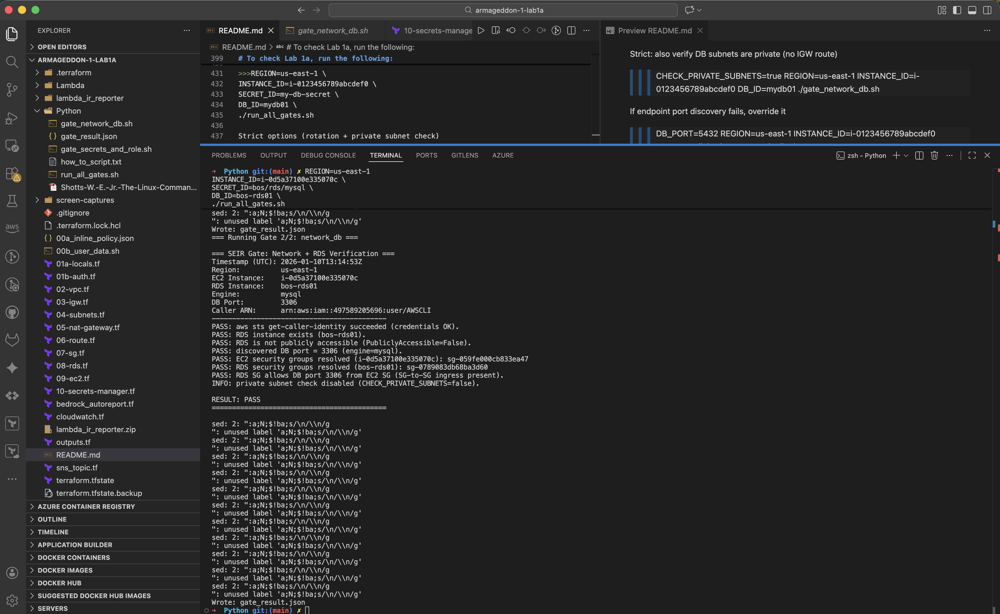

----

## Strict options (rotation + private subnet check)

### Expected Output:
Files created:
- gate_secrets_and_role.json
- gate_network_db.json
- gate_result.json ✅ combined summary

Exit code: you will see these in the Python (folder) > gate_result.json
- 0 = ready to merge / ready to grade
- 2 = fail (exact reasons provided)
- 1 = error (missing env/tools/scripts)

sc24-6

if you get this error message, copy the URL, go to github and change your 
https://github.com/settings/emails

sc24-7

sc24-8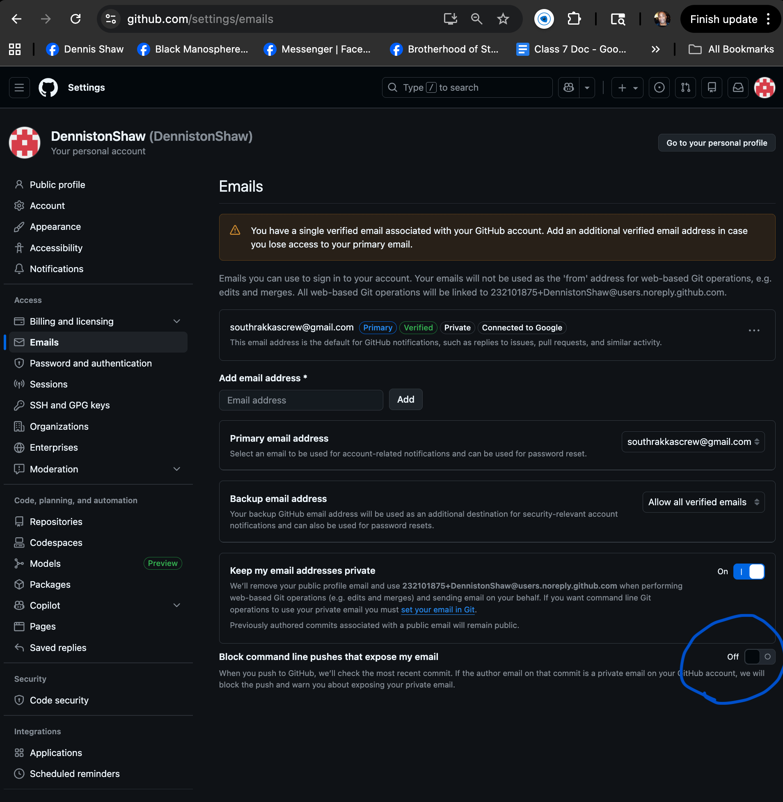

--------

# meeting #4 - my-armageddon-project-1
### Group Leader: Omar Fleming
### Team Leader: Larry Harris
### Date: 01-10-25 (Saturday)
### Time: 2:00pm -  3:00pm est. in class
### Time: 3:00pm -  6:00pm est. with group

---------

### Members present: 
- Larry Harris
- Dennis Shaw
- Kelly D Moore
- LT (Logan T)
- Torray
- Zeek-Miller314
- David McKenzie
- Ted Clayton
- Jasper
- Tre Bradshaw
- Roy Lester
- Jasper Shivers (Jdollas)

-------------

#### 3 things to change in the following codes
- ARN  
- anywhere it says "lab" in the code replace it with "bos"

------------

- catch everyone up and confirm Lab 1a is complete
- go over lab 1b notes

------------

PART I — Incident Scenario 

#### Breaking the system
- pull up url+ / init to see the page is working

sc25

- go to secrets manager in the consol > click secrets name > overview > click retrieve secrets value > edit > plaintext > make a change to the password (break the password)

sc26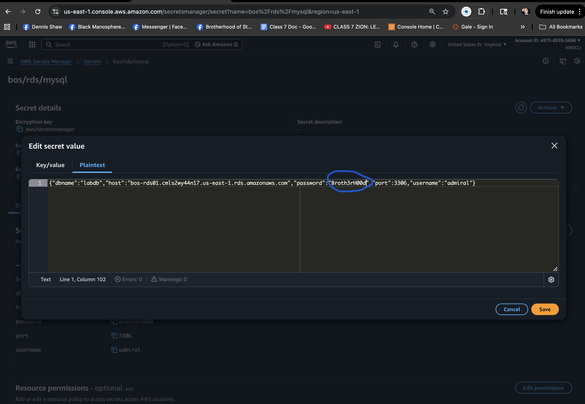

- go back to the URL add /line to confirm it's broken

sc27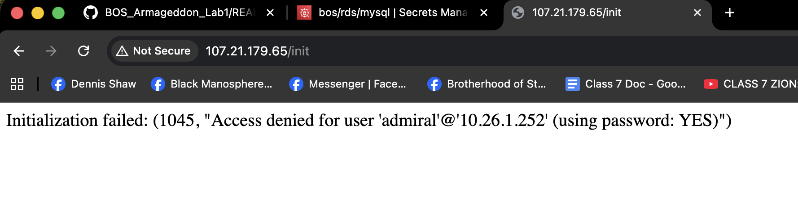

#### PART III — Monitoring & Alerting (SNS + PagerDuty Simulation)
SNS Alert Channel SNS Topic Name: lab-db-incidents aws sns create-topic --name lab-db-incidents Email Subscription (PagerDuty Simulation)

----

 >>>aws sns subscribe \
   --topic-arn <TOPIC_ARN> \
   --protocol email \
   --notification-endpoint your-email@example.com

*remember to put " \ at the end of every line except the last
 
get ARN: go to consol > SNS > Topic > copy ARN
my personal ARN: 
- arn:aws:sns:us-east-1:497589205696:bos-db-incidents

- change email
- confirm in your email that you have subscribed
  
sc28-1
----

If you are having an issue subscribing to the SNS because it automatically unsubscribes then:
- redo the steps to get an email confirmation (DO NOT CONFIRM!) 
- subcribe manually through the consol by going to Amazon SNS > Subscriptions select the pending confirmation and confirm subscription.
- it will ask you to enter the subscription confirmation url
    - go your email open, right click the confirm subscription link and copy the address/url
    - go back to consol and past this into the "Enter the subscription conformation url" box
    - confirm
  
sc28-2

sc28-3

----

CloudWatch Alarm → SNS Alarm Concept Trigger when: DB connection errors ≥ 3 in 5 minutes Alarm Creation (example)

*the original code in Theo's instructions didn't work. We found this new code and replaced it.

>>>aws cloudwatch put-metric-data \
    --namespace bos/RDSApp \
    --metric-name DBConnectionErrors \
    --value 5 \
    --unit Count

Expected results:
- email alert

sc29

- *note: you can also click the link in the email to view the alarm parameters in more detail in AWS console

sc30-1

sc30-2

sc30-3

----

### RUNBOOK SECTION 2 - Observe 2.1 Check Application Logs

>>>aws logs filter-log-events \
  --log-group-name /aws/ec2/lab-rds-app \
  --filter-pattern "ERROR"

Expected: Clear DB connection failure messages

sc31

----

#### 2.2 Identify Failure Type Students must classify:

- Credential failure? Network failure? Database availability failure? This classification is graded.

RUNBOOK SECTION 3 — Validate Configuration Sources 3.1 Retrieve Parameter Store Values

change lab to bos in the code

>>>  aws ssm get-parameters \
    --names /lab/db/endpoint /lab/db/port /lab/db/name \
    --with-decryption

Expected: Endpoint + port returned

sc32

----

3.2 Retrieve Secrets Manager Values

>>>aws secretsmanager get-secret-value \
  --secret-id lab/rds/mysql

Expected: Username/password visible Compare against known-good state

sc33-1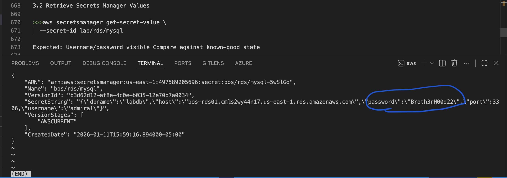

------

RUNBOOK SECTION 4 — Containment 4.1 Prevent Further Damage Do not restart EC2 blindly Do not rotate secrets again Do not redeploy infrastructure

Students must explicitly state: “System state preserved for recovery.”

- basically fix the password

sc33-2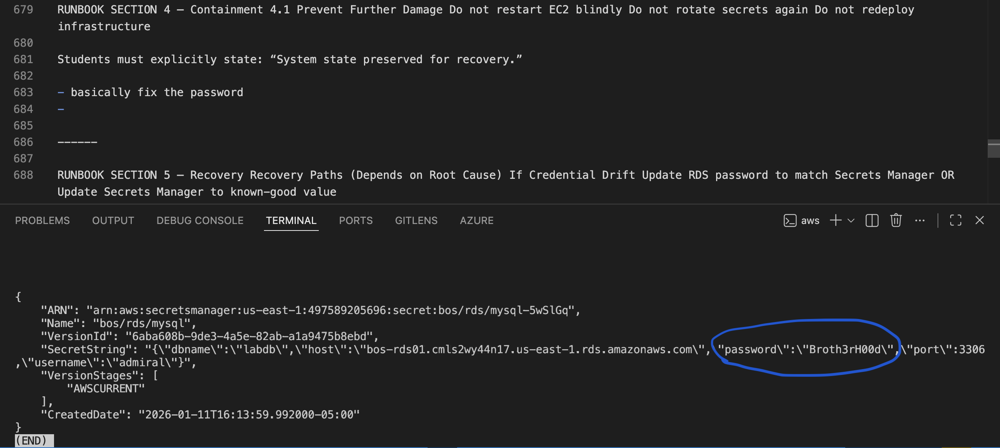

------

RUNBOOK SECTION 5 — Recovery Recovery Paths (Depends on Root Cause) If Credential Drift Update RDS password to match Secrets Manager OR Update Secrets Manager to known-good value

If Network Block
- Restore EC2 security group access to RDS on 3306

If DB Stopped
- Start RDS and wait for available

check url

Verify Recovery 
>>> curl http://<EC2_PUBLIC_IP>/list

Expected: Application returns data No errors

sc34

sc35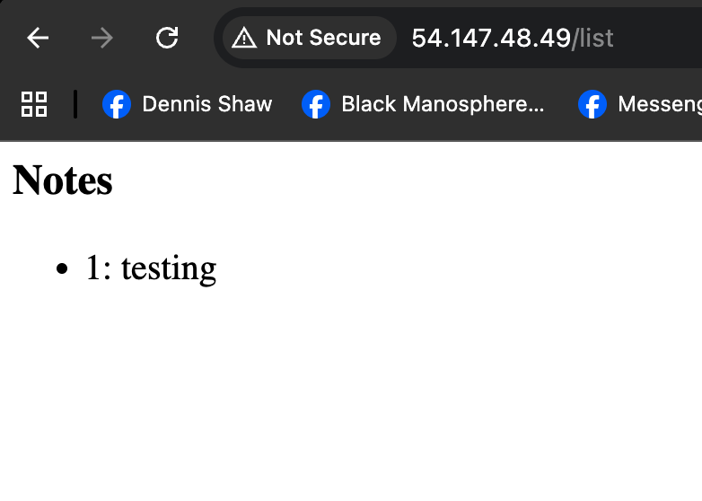

-------

RUNBOOK SECTION 6 — Post-Incident Validation 6.1 Confirm Alarm Clears

#### It wouldn't work - group solution

Run this command first, wait 5 minutes (300) after running the code which creates a second alarm to check afer we fix it.

>>>aws cloudwatch put-metric-alarm    --alarm-name bos-db-connection-success    --metric-name DBConnectionErrors    --namespace Bos/RDSApp    --statistic Sum    --period 300    --threshold 3    --comparison-operator GreaterThanOrEqualToThreshold    --evaluation-periods 1 --treat-missing-data notBreaching  --alarm-actions arn:aws:sns:us-east-1:497589205696:bos-db-incidents

run this to verify OK

>>>aws cloudwatch describe-alarms \
  --alarm-names bos-db-connection-success \
  --query "MetricAlarms[].StateValue"

sc36

Expected: OK

------

6.2 Confirm Logs Normalize

>>>aws logs filter-log-events \
  --log-group-name /aws/ec2/lab-rds-app \
  --filter-pattern "ERROR"

Expected: No new errors

sc37

-----
----

# meeting #5 - my-armageddon-project-1
### Group Leader: Omar Fleming
### Team Leader: Larry Harris
### Date: 01-11-25 (Sunday)
### Time: 2:00pm - 2:30pm est. in class
### Time: 3:00pm -  pm est. with group

---------

### Members present: 
- Larry Harris
- Dennis Shaw
- Kelly D Moore
- LT (Logan T)
- Roy Lester
- Rubeen Perry
- Ted Clayton
- Torray
- Tre Bradshaw
- David McKenzie
- Jasper Shivers (Jdollas)

---------

### In today's meeting:

- we went through Theo's instructions for Lab 1b

------------

# Final requirements for Lab 1b

### ALARM: "bos-db-connection-failure" in US East (N. Virginia)

We received this email because Amazon CloudWatch Alarm "bos-db-connection-failure" in the US East (N. Virginia) region has entered the ALARM state; "Threshold Crossed: 1 datapoint [5.0 (11/01/26 18:01:00)] was greater than or equal to the threshold (3.0)." at "Sunday 11 January, 2026 18:06:54 UTC".

### Incident Report: bos-db-connection-failure
|Field|Description|
|---|---|
|Region: |US East (N. Virginia)|
|AWS Account: | 497589205696|
|Alarm Arn: | arn:aws:cloudwatch:us-east-1:497589205696:alarm:bos-db-connection-failure|
|||
|||
|STATE CHANGE: | INSUFFICIENT_DATA -> ALARM|
|Reason for State Change: | *The password was changed resulting in:* Threshold Crossed: datapoint [5.0 (11/01/26)] was greater than or equal to the threshold (3.0).|
|Date/Time of Incident|Sunday 11, January, 2026 / 18:06:54 UTC: |
|||
|||
|STATE CHANGE: |INSUFFICIENT_DATA -> OK|
|Reason for State Change: | *Corrected the password.git*|
|Date/Time of Incident |Sunday 11, January, 2026 / 22:03:38 (UTC)|

A comprehensive investigation determined the AWS Secrets Manager password had been modified without authorization. The password has since been restored to its correct value. To prevent a recurrence we will review and refine IAM policies to ensure adherence to the principle of least privilege.

The following actions are recommended:
1. Implement multi-factor authentication (MFA) to provide an additional layer of security, and enable AWS CloudTrail to capture and retain records of all API calls and user activity.
2. Reduce mean time to resolution (MTTR) by deploying Amazon CloudWatch Synthetic's canaries to continuously monitor critical endpoints and APIs.

----

# meeting #6 - my-armageddon-project-1
### Group Leader: Omar Fleming
### Team Leader: Larry Harris
### Date: 01-13-25 (Sunday)
### Time: 8:00pm - 8:30pm est. in class
### Time: 8:30pm -  pm est. with group

---------

### Members present: 
- Larry Harris
- Dennis Shaw
- Bryce Williams
- David McKenzie
- LT (Logan T)
- Ted Clayton
- Torray
- Jay Mallard

---------

### In today's meeting:
- general discussion about discovering breakage and how things are resolved in the real world
- For our next meeting let's all set up our own Domains in next meeting

-----------
# [Lab 1c](https://github.com/DennistonShaw/armageddon/tree/main/SEIR_Foundations/LAB1/1c_terrraform)

- in 1c_terraform folder go through and add .tf folders/script
----

# [Student verification (CLI) for Bonus-A](https://github.com/DennistonShaw/armageddon/blob/main/SEIR_Foundations/LAB1/1c_bonus-A.txt)

### 1. Prove EC2 is private (no public IP)

run this code, replace instance ID
- my personal ID: ids i-06597b6baa04cddde

 >>> aws ec2 describe-instances \
  --instance-ids <INSTANCE_ID> \
  --query "Reservations[].Instances[].PublicIpAddress"

Expected: 
- null

sc38

----

### 2. Prove VPC endpoints exist
- ad vpc id / my personal ID: vpc-0cd7e9e21449091af

sc39

>>>aws ec2 describe-vpc-endpoints \
  --filters "Name=vpc-id,Values=<VPC_ID>" \
  --query "VpcEndpoints[].ServiceName"

Expected: list includes:
- ssm 
- ec2messages 
- ssmmessages 
- logs 
- secretsmanager
- s3

sc40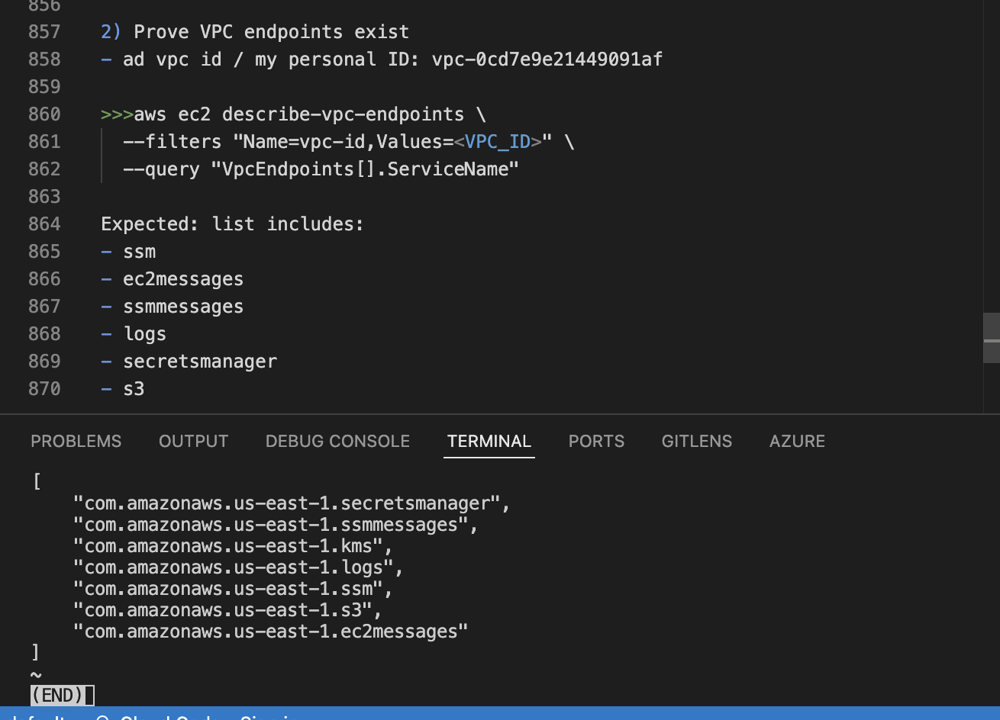

----

### 3. Prove Session Manager path works (no SSH)

sc41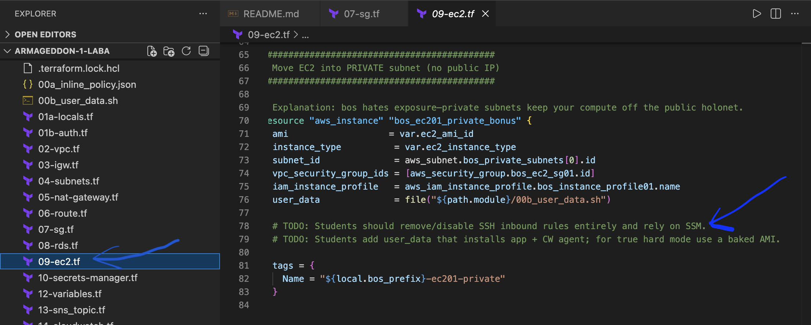

sc42

>>>aws ssm describe-instance-information \
  --query "InstanceInformationList[].InstanceId"

Expected: 
- your private EC2 
- instance ID appears

### 4. Prove the instance can read both config stores

- Run from SSM session:
- change secret-id name (AWS Secrets manager > Secrets): bos/rds/mysql

>>>aws ssm get-parameter --name /lab/db/endpoint

sc43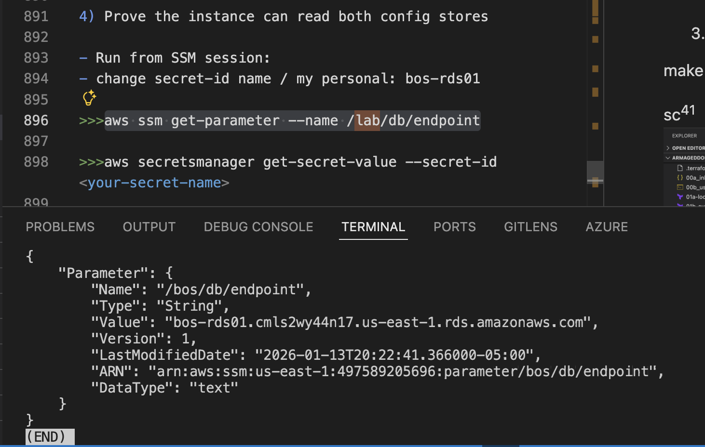
  
>>>aws secretsmanager get-secret-value --secret-id <your-secret-name>

sc44

### 5. Prove CloudWatch logs delivery path is available via endpoint

 - change < prefix > to bos in the following code
  
>>>aws logs describe-log-streams \
    --log-group-name /aws/ec2/<prefix>-rds-app

sc45

----
----

# NEW FIXES 01-15-25 (Thursday)  when copying or cloning someone's repository lab

Explanation: we had a few problems this past Tuesday with the build and obtaining certifications. At this point we need everyone to:

- clone it to your local
- create a new folder and copy and paste the files from the clone to
- copy your README file, any snapshots/screen captures, .gitignore and iam-role.tf, and the inline_policiy file from your old folder into your new folder
- go to your variables.tf and change your: 
  - email address
  - AWS account number

sc46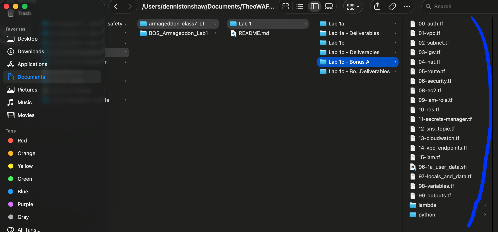

sc47

sc48

sc49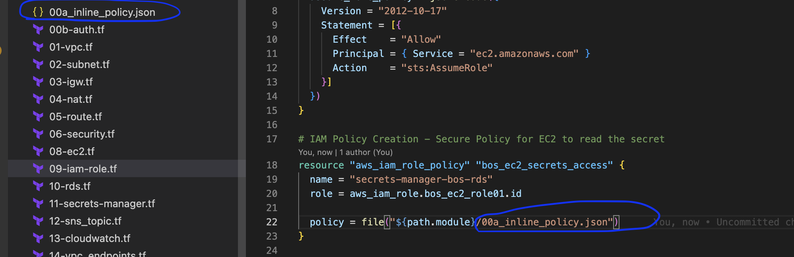

Let's get everyone up to date, hopefully before Saturday's meeting. We would like to focus on getting everyone a Domain name (be prepared to spend $3-$15). You will need to obtain a domain to continue with the labs past this point.

https://github.com/DennistonShaw/my-armageddon-projects.git

----
----

# [Lab 1c - Bonus b](https://github.com/DennistonShaw/armageddon/blob/main/SEIR_Foundations/LAB1/1c_bonus-B.md)

EC2 runs app on the target port They must ensure their user-data/app listens on port 80 (or update TG/SG accordingly).

### Verification commands (CLI) for Bonus-B

- TG_ARN: arn:aws:elasticloadbalancing:us-east-1:497589205696:targetgroup/bos-tg01/f5193bd65c03bd93
- ALB_ARN: arn:aws:elasticloadbalancing:us-east-1:497589205696:loadbalancer/app/bos-alb01/5b2c00ca9e5d47f2

### 1. ALB exists and is active

>>>aws elbv2 describe-load-balancers
--names bos-alb01
--query "LoadBalancers[0].State.Code"

sc50-1

### 2. HTTPS listener exists on 443

>>>aws elbv2 describe-listeners
--load-balancer-arn <ALB_ARN>
--query "Listeners[].Port"

sc50-2

### 3. Target is healthy

>>>aws elbv2 describe-target-health
--target-group-arn <TG_ARN>

sc53-3

### 4. WAF attached

>>>aws wafv2 get-web-acl-for-resource
--resource-arn <ALB_ARN>

sc50-4

### 5. Alarm created (ALB 5xx)

>>>aws cloudwatch describe-alarms
--alarm-name-prefix bos-alb-5xx

sc50-5

### 6. Dashboard exists

>>>aws cloudwatch list-dashboards
--dashboard-name-prefix bos

sc50-6

----
----

# meeting #7 - my-armageddon-project-1
### Group Leader: Omar Fleming
### Team Leader: Larry Harris
### Date: 01-17-25 (Saturday)
### Time: 2:00pm - 2:30pm est. in class
### Time: 2:30pm -  pm est. with group

---------

### Members present: 
- Larry Harris
- Dennis Shaw
- Bryce Williams
- Kelly D Moore
- Ted Clayton
- Logan (LT) 
- David Mckenzie
- Torray
- Zeek-Miller314
- Jasper Shivers (Jdollas)
---------

## In Class

**** deadline for Class 7 Armageddon submissions: 2/3/26 ****

Armageddon repo: https://github.com/BalericaAI/armageddon/tree/main/SEIR_Foundations

Class 7 must do:
- Lab 1, all the way to bonus F 
- Lab 2, all the way to be BAM B 
- Lab 3a and 3b
* the further you go in the labs, the more work ready you become
----

### Question and Answer with Theo:

Bryce Williams issue: 
- if the script gives you the answer that you need but not the validation its ok

Larry Harris: Understanding Lab 1c bonus f:
- follow the instructions as close as we can
- access logs are in s3
- modify terraform but make sure bucket stays persistant
- s3 bucket has to be global and unique name. so claim your bucket and makes sure it doesn't delete. use consol after the bucket is created in Terraform

- route 53 should be perminent don't keep destroying

----
----
# Beyond this point you need a Domain and it's certificates to execute the deliverables 
----

# meeting #8 - my-armageddon-project-1
### Group Leader: Omar Fleming
### Team Leader: Larry Harris
### Date: 01-18-25 (Sunday)
### Time: 2:00pm - 3:00pm est. in class
### Time: 3:00pm -  6:30pm est. with group

---------

### Members present: 
- Larry Harris
- Dennis Shaw
- Bryce Williams
- Kelly D Moore
- Ted Clayton
- Logan (LT)
- David McKenzie
- Jasper Shivers (Jdollas)

--------

## In Class
- working mostly individually
- touble shooting
- completing bonus f

-------

# [Lab 1c bonus c](https://github.com/DennistonShaw/armageddon/blob/main/SEIR_Foundations/LAB1/1c_bonus-C.md)
  
### Student verification (CLI)

**My Personal info for this section:**

- Hosted zone name: southrakkasmedia.com
- Hosted zone ID: Z00021892WE8NHJ89CAOJ
- Certificate arn: arn:aws:acm:us-east-1:497589205696:certificate/063ee92d-09da-4aef-b8fd-fee77071d053
- Load balancer ARN: arn:aws:elasticloadbalancing:us-east-1:497589205696:loadbalancer/app/bos-alb01/5b2c00ca9e5d47f2

#### 1. Confirm hosted zone exists (if managed)

  >>>aws route53 list-hosted-zones-by-name \
    --dns-name southrakkasmedia.com \
    --query "HostedZones[].Id"

sc51-1

#### 2. Confirm app record exists

  >>>aws route53 list-resource-record-sets \
  --hosted-zone-id <ZONE_ID> \
  --query "ResourceRecordSets[?Name=='app.southrakkasmedia.com.']"

sc51-2

#### 3. Confirm certificate issued

  >>>aws acm describe-certificate \
  --certificate-arn <CERT_ARN> \
  --query "Certificate.Status"

Expected: ISSUED

sc51-3

#### 4. Confirm HTTPS works

  >>>curl -I https://app.southrakkasmedia.com

Expected: HTTP/1.1 200 (or 301 then 200 depending on your app)

sc51-4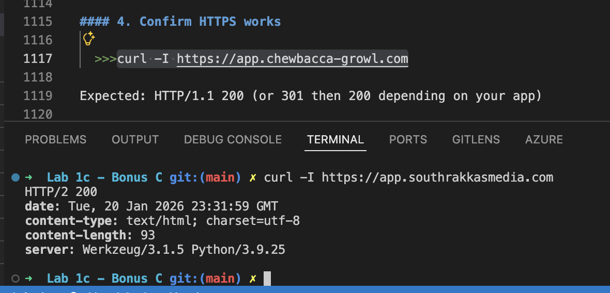

----

# [Lab 1c bonus d](https://github.com/DennistonShaw/armageddon/blob/main/SEIR_Foundations/LAB1/1c_bonus-D.md)

[Student verification (CLI) — DNS + Logs](https://github.com/DennistonShaw/armageddon/blob/main/SEIR_Foundations/LAB1/1c_bonus-D.md?plain=1)

1. Verify apex record exists
   
  >>>aws route53 list-resource-record-sets \
    --hosted-zone-id <ZONE_ID> \
    --query "ResourceRecordSets[?Name=='southrakkasmedia.com.']"

sc52-1

2. Verify ALB logging is enabled
   
  >>>aws elbv2 describe-load-balancers \
    --names chewbacca-alb01 \
    --query "LoadBalancers[0].LoadBalancerArn"

sc52-2

Then:
  >>>aws elbv2 describe-load-balancer-attributes \
  --load-balancer-arn <ALB_ARN>

  Expected attributes include:
  access_logs.s3.enabled = true
  access_logs.s3.bucket = your bucket
  access_logs.s3.prefix = your prefix

sc52-3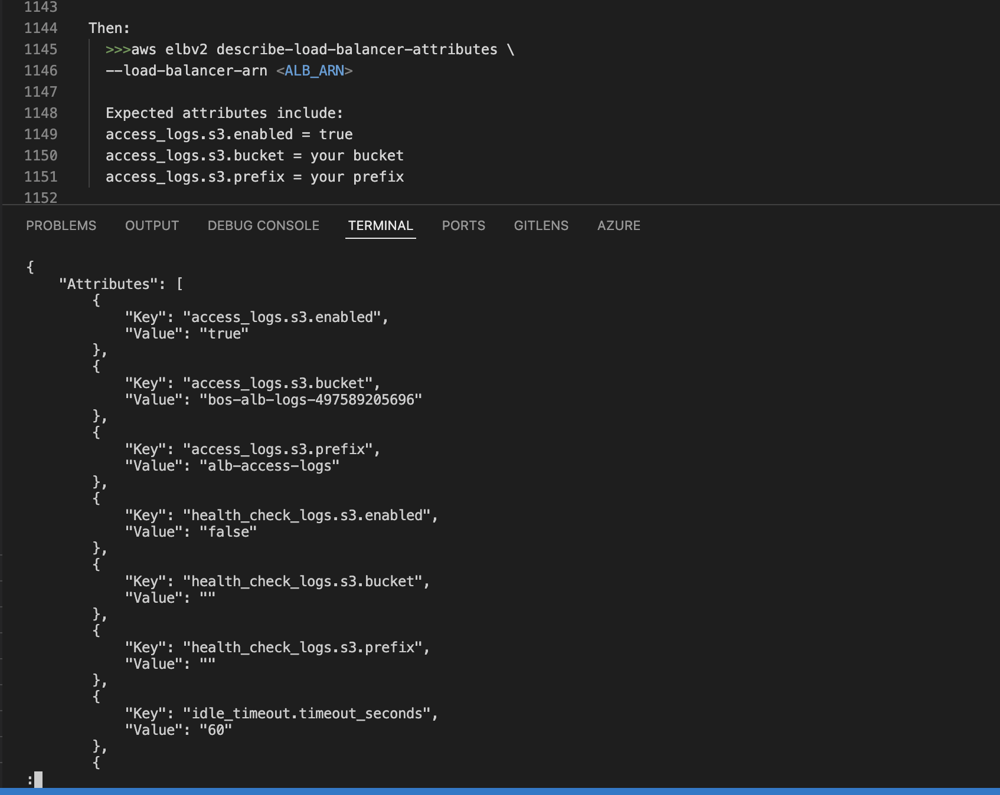

3. Generate some traffic  

- there is a problem with the first curl code option (why its striked out) just run the second one

>>>~~curl -I https://southrakkasmedia.com~~

>>>curl -I https://app.southrakkasmedia.com

sc52-4

4. Verify logs arrived in S3 (may take a few minutes)

s3 bucket name: bos-alb-logs-497589205696
account ID: 497589205696
this is the pathway into your s3 bucket
   
  >>>aws s3 ls s3://<BUCKET_NAME>/<PREFIX>/AWSLogs/<ACCOUNT_ID>/elasticloadbalancing/ --recursive | head

sc52-5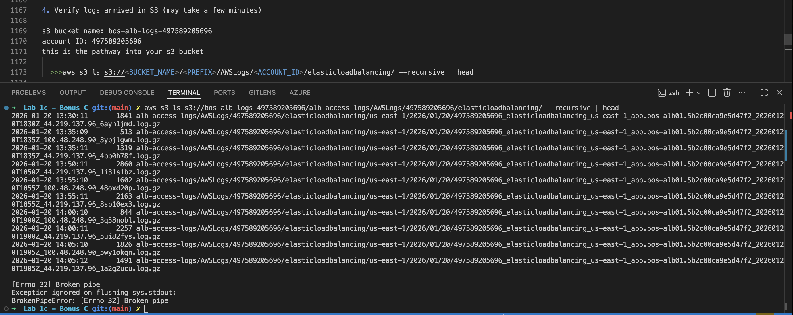

Why this matters to YOU (career-critical point)
This is incident response fuel:
  Access logs tell you:
    client IPs
    paths
    response codes
    target behavior
    latency

Combined with WAF logs/metrics and ALB 5xx alarms, you can do real triage; is it attackers, misroutes, or downstream failure?

----

# [Lab 1c bonus e](https://github.com/DennistonShaw/armageddon/blob/main/SEIR_Foundations/LAB1/1c_bonus-E.md)

Below is Lab 1C-Bonus-E (continued): WAF logging in Terraform (with toggles), plus verification commands.

- change chewbacca references to bos

### 1. [Add variables](https://github.com/DennistonShaw/armageddon/blob/main/SEIR_Foundations/LAB1/1c_terrraform/variables.tf) (append to variables.tf)
>>>variable "waf_log_destination" {
  description = "Choose ONE destination per WebACL: cloudwatch | s3 | firehose"
  type        = string
  default     = "cloudwatch"
}

>>>variable "waf_log_retention_days" {
  description = "Retention for WAF CloudWatch log group."
  type        = number
  default     = 14
}

>>>variable "enable_waf_sampled_requests_only" {
  description = "If true, students can optionally filter/redact fields later. (Placeholder toggle.)"
  type        = bool
  default     = false
}

### 2. Add file: [bonus_b_waf_logging.tf](https://github.com/DennistonShaw/armageddon/blob/main/SEIR_Foundations/LAB1/1c_terrraform/bonus_b_waf_logging.tf) (Look in Folder)

This provides three skeleton options (CloudWatch / S3 / Firehose). Students choose one via var.waf_log_destination.

### 3. [Outputs](https://github.com/DennistonShaw/armageddon/blob/main/SEIR_Foundations/LAB1/1c_terrraform/outputs.tf) (append to outputs.tf)

Explanation: Coordinates for the WAF log destination—Chewbacca wants to know where the footprints landed.
>>>output "chewbacca_waf_log_destination" {
  value = var.waf_log_destination
}

>>>output "chewbacca_waf_cw_log_group_name" {
  value = var.waf_log_destination == "cloudwatch" ? aws_cloudwatch_log_group.chewbacca_waf_log_group01[0].name : null
}

>>>output "chewbacca_waf_logs_s3_bucket" {
  value = var.waf_log_destination == "s3" ? aws_s3_bucket.chewbacca_waf_logs_bucket01[0].bucket : null
}

>>>output "chewbacca_waf_firehose_name" {
  value = var.waf_log_destination == "firehose" ? aws_kinesis_firehose_delivery_stream.chewbacca_waf_firehose01[0].name : null
}

### 4. Student verification (CLI)

#### A. Confirm WAF logging is enabled (authoritative)
  >>>aws wafv2 get-logging-configuration \
    --resource-arn <WEB_ACL_ARN>

Expected: LogDestinationConfigs contains exactly one destination.

sc53-1

#### B. Generate traffic (hits + blocks)
  >>>~~curl -I https://southrakkasmedia.com/~~

  >>>curl -I https://app.southrakkasmedia.com/

sc53-2

#### C1. If [CloudWatch Logs destination](https://us-east-1.console.aws.amazon.com/cloudwatch/home?region=us-east-1#logsV2:log-groups)

- reference the var.project_name ie. replace project with bos
  
  >>>aws logs describe-log-streams \
  --log-group-name aws-waf-logs-<project>-webacl01 \
  --order-by LastEventTime --descending

sc53-3

Then pull recent events:
  >>>aws logs filter-log-events \
  --log-group-name aws-waf-logs-<project>-webacl01 \
  --max-items 20

sc53-4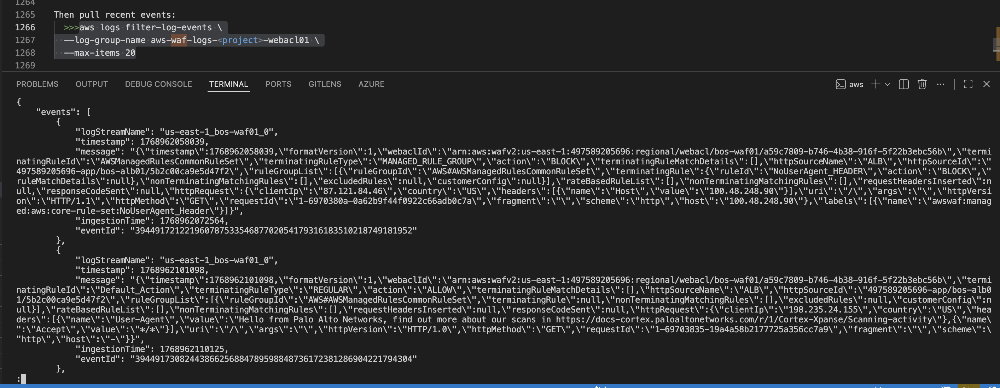

----

# [Lab 1c bonus f](https://github.com/DennistonShaw/armageddon/blob/main/SEIR_Foundations/LAB1/1c_bonus-F.md)

helpful content: [Analyzing AWS WAF logs: Leveraging CloudWatch Log Insights](https://aws.amazon.com/ar/video/watch/b117e232382/)

Go to the consol > cloudwatch > Log Insights

In Query definition > query scope > select up to 50 log groups (dropdown) > select the first and last option

sc54-1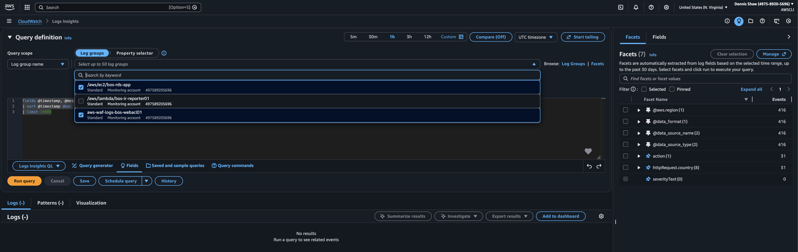

#### Requirements: 
- Set the time range to Last 15 minutes (or match incident window).

sc54-2

## A) WAF Queries (CloudWatch Logs Insights)

A1) “What’s happening right now?” (Top actions: ALLOW/BLOCK)
- copy and past query

>>>fields @timestamp, action
| stats count() as hits by action
| sort hits desc

sc54-3

- Run query

sc54-4

A2) Top client IPs (who is hitting us the most?)
>>>fields @timestamp, httpRequest.clientIp as clientIp
| stats count() as hits by clientIp
| sort hits desc
| limit 25

sc54-5

A3) Top requested URIs (what are they trying to reach?)
>>>fields @timestamp, httpRequest.uri as uri
| stats count() as hits by uri
| sort hits desc
| limit 25

sc54-6

A4) Blocked requests only (who/what is being blocked?)
>>>fields @timestamp, action, httpRequest.clientIp as clientIp, httpRequest.uri as uri
| filter action = "BLOCK"
| stats count() as blocks by clientIp, uri
| sort blocks desc
| limit 25

sc54-7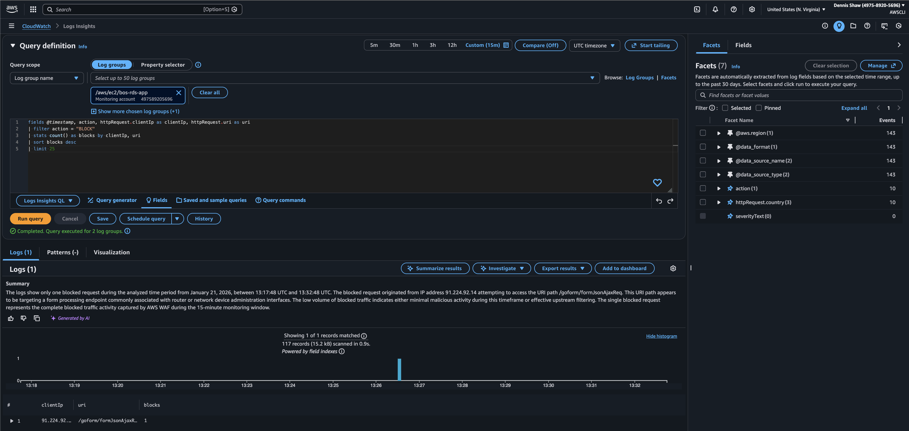

to set up clould Athena sql query:
go to Amazon Athena > Query Settings > manage > Browse S3 > Choose S3 data set > click choose > enter AWS account ID > click save

sc54-8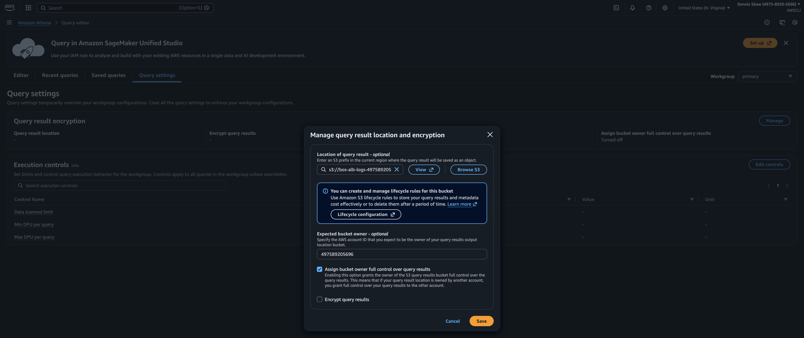

A5) Which WAF rule is doing the blocking?
>>>fields @timestamp, action, terminatingRuleId, terminatingRuleType
| filter action = "BLOCK"
| stats count() as blocks by terminatingRuleId, terminatingRuleType
| sort blocks desc
| limit 25

sc54-9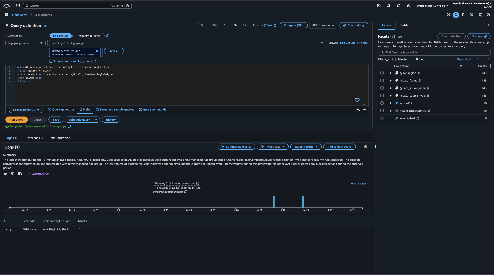

A6) Rate of blocks over time (did it spike?)
>>>fields @timestamp, httpRequest.clientIp as clientIp, httpRequest.uri as uri
| filter uri like /wp-login|xmlrpc|\.env|admin|phpmyadmin|\.git|\/login/
| stats count() as hits by clientIp, uri
| sort hits desc
| limit 50

sc54-10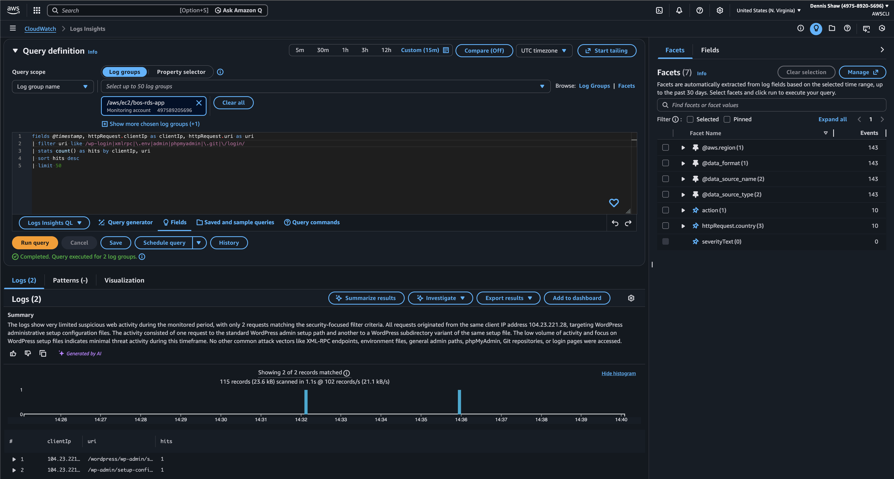

#edit
fields @timestamp, httpRequest.clientIp as clientIp, httpRequest.uri 

A7) Suspicious scanners (common patterns: admin paths, wp-login, etc.)
>>>fields @timestamp, httpRequest.clientIp as clientIp, httpRequest.uri as uri
| filter uri like /wp-login|xmlrpc|\.env|admin|phpmyadmin|\.git|\/login/
| stats count() as hits by clientIp, uri
| sort hits desc
| limit 50

sc54-11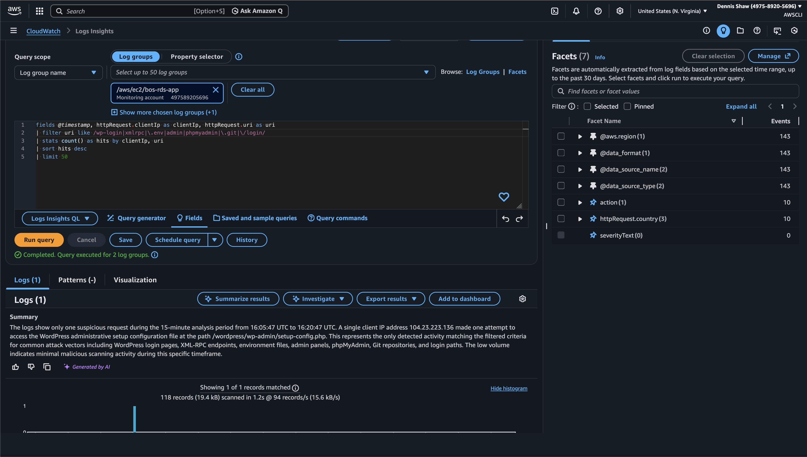

A8) Country/geo (if present in your WAF logs)
Some WAF log formats include httpRequest.country. If yours does:

>>>fields @timestamp, httpRequest.country as country
| stats count() as hits by country
| sort hits desc
| limit 25

sc54-12

## B) App Queries (EC2 app log group)

These assume your app logs include meaningful strings like ERROR, DBConnectionErrors, timeout, etc
(You should enforce this.)

B1) Count errors over time (this should line up with the alarm window)

the following code has been adjusted to work
>>>fields @timestamp, @message
| filter @message like /DBConnectionError|Exception|Traceback|DB|timeout|refused/
| stats count() as errors by bin(1m)
| sort minute asc

sc54-13

B2) Show the most recent DB failures (triage view)
>>>fields @timestamp, @message
| filter @message like /DB|mysql|timeout|refused|Access denied|could not connect/
| sort @timestamp desc
| limit 50

sc54-14

B3) “Is it creds or network?” 
- classifier hints Credentials drift often shows: 
  - Access denied, authentication failures
- Network/SecurityGroup often shows: 
  - timeout, refused, “no route”, hang

  >>>fields @timestamp, @message
| filter tolower(@message) like /access denied|authentication failed|timeout|refused|no route|could not connect/
| stats count() as hits by
  if(
    tolower(@message) like /DBConnectionError|authentication failed/, "Creds/Auth",
    if(
      tolower(@message) like /timeout|no route/, "Network/Route",
      if(
        tolower(@message) like /refused/, "Port/SG/ServiceRefused",
        "Other"
      )
    )
  ) as category
| sort hits desc

sc54-15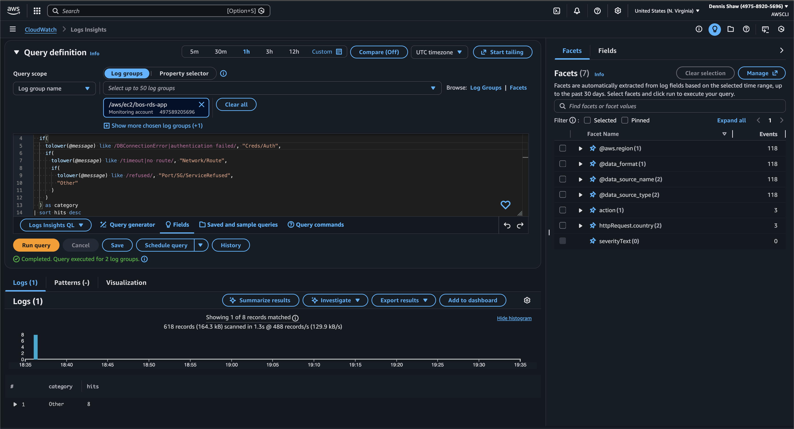

-----
!!!!!!!!! check this
Steps to view raw log events in the CloudWatch console:

1. Steps to view raw log events in the CloudWatch console:
2. In the navigation pane, choose Logs, then choose Log groups.
3. From the list of log groups, choose the name of the log group you want to view.
4. From the list of log streams, choose the name of the log stream that contains the event you are interested in.
5. Above the list of log events, you will see display options. Choose Text to display all log events in their raw, plain text format. The default view often formats the events (e.g., as rows or collapsed JSON), so switching to "Text" will show the original log data as it was ingested. 
-----

B4) Extract structured fields (Requires log JSON)
If you log JSON like: {"level":"ERROR","event":"db_connect_fail","reason":"timeout"}:

  >>>fields @timestamp, level, event, reason
| filter level="DBConnectionError"
| stats count() as n by event, reason
| sort n desc

(Thou Shalt need to emit JSON logs for this one.)

sc54-16

sc54-17

C) Correlation “Enterprise-style” mini-workflow (Runbook Section)
Add this to the incident runbook:

Step 1 — Confirm signal timing
  CloudWatch alarm time window: last 5–15 minutes
  Run App B1 to see error spike time bins

Step 2 — Decide: Attack vs Backend Failure
  Run WAF A1 + A6:
    If BLOCK spikes align with incident time → likely external pressure/scanning
    If WAF is quiet but app errors spike → likely backend (RDS/SG/creds)

Step 3 — If backend failure suspected
  Run App B2 and classify:
    Access denied → secrets drift / wrong password
    timeout → SG/routing/RDS down
  Then retrieve known-good values:
    Parameter Store /lab/db/*
    Secrets Manager /<prefix>/rds/mysql

Step 4 — Verify recovery
  App errors return to baseline (B1)
  WAF blocks stabilize (A6)
  Alarm returns to OK
  curl https://app.southrakkasmedia.com/list works

  # [Lab 2a](https://github.com/DennistonShaw/armageddon/tree/main/SEIR_Foundations/LAB2)

  ### IMPORTANT before you start lab 2!

  - Download this [user_data.sh](https://github.com/Nightwolf197676/BOS_Armageddon_Lab1/blob/main/96-1a_user_data.sh) file from Larry's repo and replace yours.
    - explanation: it adds additional directories and files to the RDS app needed to complete the deliverables
  
- sc55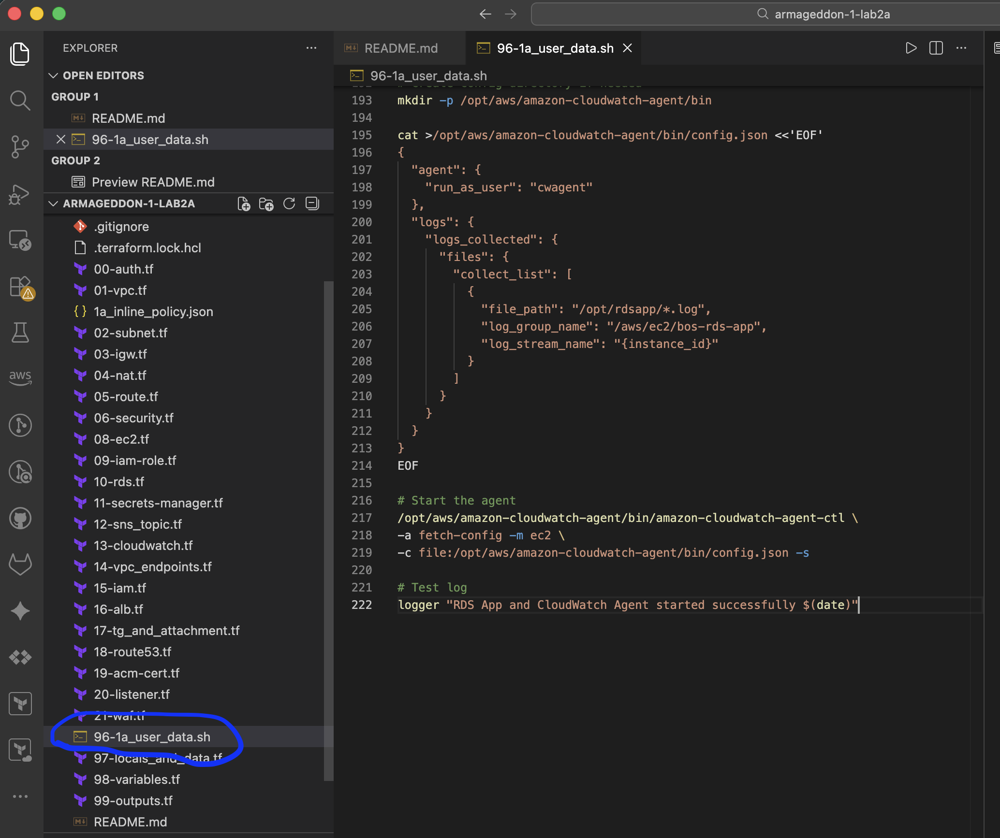

----

### Verification CLI (students must prove all 3 requirements)

### 1. “VPC is only reachable via CloudFront”

A) Direct ALB access should fail (403)
  >>>curl -I https://<ALB_DNS_NAME>

Expected: 403 (blocked by missing header)

sc56-1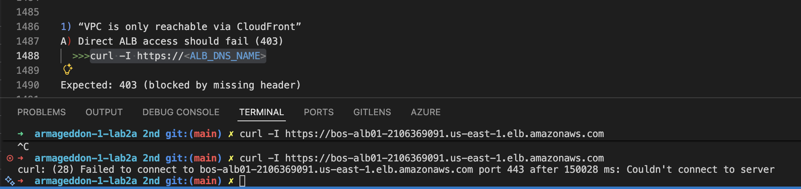

B) CloudFront access should succeed
  >>>curl -I https://southrakkasmedia.com

sc56-2

  >>>curl -I https://app.southrakkasmedia.com

Expected: 200/301 → 200

sc56-3

----

### 2. WAF moved to CloudFront
  >>>aws wafv2 get-web-acl \
  --name <project>-cf-waf01 \
  --scope CLOUDFRONT \
  --id <WEB_ACL_ID>

sc56-4

And confirm distribution references it:
  >>>aws cloudfront get-distribution \
  --id <DISTRIBUTION_ID> \
  --query "Distribution.DistributionConfig.WebACLId"

Expected: WebACL ARN present.

sc56-5

----

### 3. southrakkasmedia.com points to CloudFront
  >>>dig southrakkasmedia.com A +short

  >>>dig app.southrakkasmedia.com A +short

Expected: resolves to CloudFront (you’ll see CloudFront anycast behavior, not ALB IPs)

sc56-6

# [Lab 2b](https://github.com/DennistonShaw/armageddon/blob/main/SEIR_Foundations/LAB2/2b_lab.txt)

